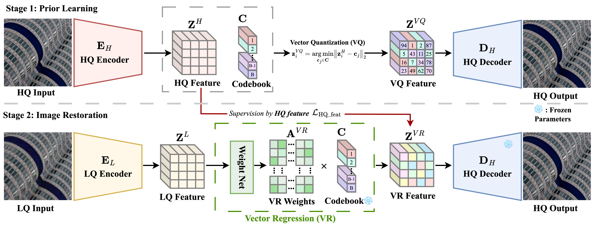

# Rethinking the Role of Vector Quantization for Blind Image Restoration

**IEEE Transactions on Multimedia (TMM), Accepted on Dec. 30, 2025**

---

## 🗂️ Todo List

- [ ] **Datasets**  
  Public benchmark datasets will be organized and released.

- [ ] **Pretrained Models**  
  Model weights for all experiments in the paper will be made available.

- [ ] **Training & Evaluation Code**  
  Complete training and testing pipelines will be released for reproducibility.

---


## Introduction

Blind Image Restoration (BIR) aims to recover high-quality (HQ) images from severely degraded low-quality (LQ) inputs with unknown degradations, such as blur, noise, compression artifacts, and low resolution.  
Recent BIR methods increasingly rely on **vector-quantized (VQ) generative models** (e.g., VQGAN) to leverage powerful discrete priors for hallucinating realistic textures under heavy degradation.

Despite their success, existing VQ-based BIR methods inherit a **fundamental mismatch** between the *generation-oriented* design of vector quantization and the *reconstruction-oriented* objective of image restoration. This work revisits the role of vector quantization in BIR and proposes a simple yet effective alternative.

---

## Motivation

Vector quantization was originally designed to improve **image generation quality** by mapping continuous features onto a discrete codebook, which helps reduce uncertainty and stabilize generative modeling.  
However, **blind image restoration prioritizes reconstruction fidelity**, requiring accurate and continuous estimation of latent features corresponding to the original HQ image.

This discrepancy leads to a key limitation in existing VQ-based BIR methods:

- The discrete one-hot code selection in VQ introduces **quantization errors and information bottlenecks**.
- While beneficial for generative diversity, this discreteness restricts the ability to faithfully reconstruct fine-grained image details.
- As a result, restoration performance is often suboptimal, especially under severe degradations.

---

## Key Observations

Through systematic analysis of four representative VQ-based BIR methods, we identify the following observations:

- **Observation 1:**  
  HQ features extracted directly from the HQ encoder reconstruct images significantly better than their VQ-quantized counterparts.

- **Observation 2:**  
  Discrete VQ operations constrain the representation capacity of the codebook and limit reconstruction accuracy in BIR tasks.

These observations indicate that **VQ-quantized features are not the optimal learning target** for reconstruction-oriented restoration.

---

## Method Overview: Vector Regression (VR)

To resolve the inconsistency between vector quantization and blind image restoration, we propose **Vector Regression (VR)** as a continuous alternative to the VQ operation.

Instead of selecting a single codebook entry via hard or soft assignment, VR learns **real-valued regression weights over the entire HQ codebook**, enabling flexible linear combinations of code vectors to approximate HQ features more accurately.

Key characteristics of VR include:

- **Continuous representation:**  
  Transitions from discrete code selection to continuous feature estimation.
- **Regression over codebook:**  
  Learns weighted combinations of codebook entries rather than one-hot assignments.
- **HQ feature supervision:**  
  The regression module is directly supervised by HQ features extracted during the prior learning stage.

---

<!-- ========================= -->
<!-- Figure 2: VQ vs VR -->
<!-- Recommended: Method comparison illustration -->
<p align="center">
  
</p>
<p align="center">
  <em>From hard VQ to vector regression: VR enables more flexible and accurate feature approximation.</em>
</p>
<!-- ========================= -->

---

## Contributions

The main contributions of this work are summarized as follows:

- We reveal the **inconsistency between generation-oriented vector quantization and reconstruction-oriented blind image restoration**, which has been largely overlooked in prior work.
- We demonstrate that **HQ features provide a stronger supervision signal** than VQ-quantized features for improving restoration fidelity.
- We propose a **simple yet effective Vector Regression (VR) module** that replaces VQ operations and consistently improves multiple VQ-based BIR methods across different restoration tasks.

---

## Results at a Glance

Extensive experiments show that replacing VQ with VR consistently improves:

- Blind face restoration (e.g., CodeFormer, DAEFR)
- Blind image super-resolution (e.g., FeMaSR, AdaCode)

VR achieves higher PSNR and SSIM while maintaining favorable computational efficiency.

---

*The VR module is lightweight, plug-and-play, and can be easily integrated into existing VQ-based blind image restoration frameworks.*

## Citation

If you find this work useful in your research, please consider citing:

```bibtex
@article{Zheng2025VR4BIR,
  title   = {Rethinking the Role of Vector Quantization for Blind Image Restoration},
  author  = {Zheng, Zhaolin and Xue, Liqi and Li, Linghao and Gong, Chenwei and Zhen, Xiantong and Xu, Jun},
  journal = {IEEE Transactions on Multimedia},
  year    = {2025},
  note    = {Accepted}
}

